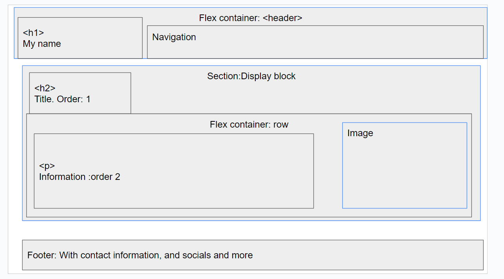
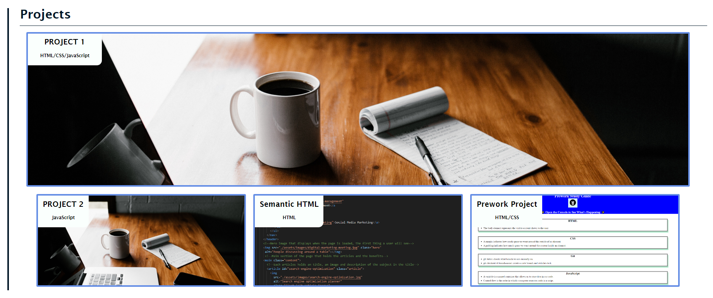

# Creating a Portfolio Site Week 2

## Github Pages

**[Link to the GitHub Pages website](https://amillsy.github.io/Creating-a-Portfolio-Site-Week-2/ "Portfolio page website")**

## User Story

```
AS AN employer
I WANT to view a potential employee's deployed portfolio of work samples
SO THAT I can review samples of their work and assess whether they're a good candidate for an open position
```

## Acceptance Criteria

Here are the critical requirements necessary to develop a portfolio that satisfies a typical hiring manager’s needs:

```
GIVEN I need to sample a potential employee's previous work
WHEN I load their portfolio
THEN I am presented with the developer's name, a recent photo or avatar, and links to sections about them, their work, and how to contact them
WHEN I click one of the links in the navigation
THEN the UI scrolls to the corresponding section
WHEN I click on the link to the section about their work
THEN the UI scrolls to a section with titled images of the developer's applications
WHEN I am presented with the developer's first application
THEN that application's image should be larger in size than the others
WHEN I click on the images of the applications
THEN I am taken to that deployed application
WHEN I resize the page or view the site on various screens and devices
THEN I am presented with a responsive layout that adapts to my viewport
```

## Description

This project has developed my understanding of the entiritry of HTML and CSS to a large extent by having to do this without the help of a tutor so whenever I had a problem, I had to understand what was wrong and then learn from my mistakes. By doing this, I have learnt a huge amount about how to create a sementatic website that uses all the modern CSS and HTML standards so that an end user is able to resize and resphape there browser and still be able to have a readable and enjoyable experience when
viewing the page.

Futhermore, it has helped me understand how to layout my pages. When doing this project I made wireframes of the website which increased my efficency massively, as I didn't get stuck wondering about how the page should be laid out.



## Usage

I would be able to display all my portfolio on a single website, where a user or employee would be able to access this main website and then see all of my previous projects. Great for having everything in a centeral location as the employee would be able to easily move throughout the site.

They would be able to get all the main details as there is:

### About me:


### Projects:



### Contact me:


